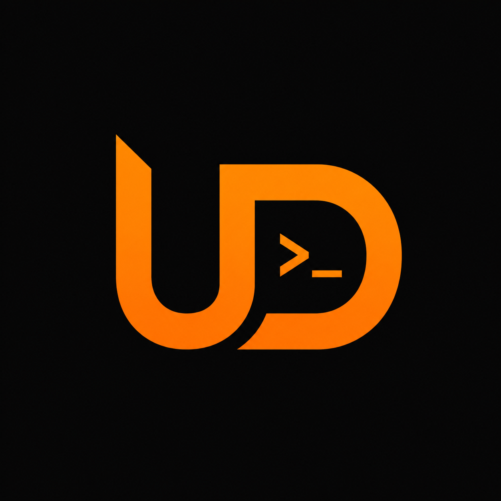

# ultra-dev-plugin

<p align="center">
  
</p>

**A controlled feature-development workflow for Claude Code.**

Brainstorm → Spec → Plan → Execute. The human drives every hand-off.

[](.claude-plugin/plugin.json)
[](https://docs.claude.com/en/docs/claude-code)
[](https://github.com/obra/superpowers)

---

## Overview

`ultra-dev-plugin` chains four core skills — **brainstorm**, **spec-writing**, **spec-to-plan**, **executing-plan** — into a single deliberate workflow. Nine optional aux skills — **research**, **code-review**, **test-writing**, **doc-writing**, **erd-writing**, **project-docs**, **user-manual-writing**, **i-have-adhd**, **setup-ultra-dev** — run on demand.

The `research` skill depends on the [`context7`](https://github.com/upstash/context7) MCP server for live, version-accurate library docs. **Install it yourself** before using `research` — see [Optional: context7 for `research`](#optional-context7-for-research) below.

The plugin enforces one discipline:

> Design before spec. Spec before plan. Plan before code.
> An explicit `yes` from the user at every hand-off.

Every feature lives in its own slug directory under `docs/ultra-dev/<slug>/`.

---

## Status

**In active development.** The four core skills and six aux skills are functional, but the plugin is still evolving. APIs, prompts, and conventions may change between versions. Feedback and issues welcome.

---

## Table of contents

- [Status](#status)
- [Install](#install)
- [Workflow](#workflow)
- [Core skills](#core-skills)
- [Aux skills](#aux-skills)
- [Usage](#usage)
- [Recommended CLAUDE.md guidance](#recommended-claudemd-guidance)
- [Conventions](#conventions)
- [Layout](#layout)
- [Roadmap](#roadmap)

---

## Install

In Claude Code, run:

```bash
/plugin marketplace add Petrina99/ultra-dev
/plugin install ultra-dev-plugin@ultra-dev-marketplace
```

Restart Claude Code so the skills register. They become available via the `Skill` tool and via the auto-trigger keywords listed below.

Then, in each project you want to use the plugin in:

```bash
/setup-ultra-dev
```

Four questions, one managed block written into that project's `CLAUDE.md` — see [setup-ultra-dev](#setup-ultra-dev). Optional; every skill works without it.

### Optional: context7 for `research`

The `research` aux skill calls the [`context7`](https://github.com/upstash/context7) MCP server to pull live library docs. It is **not bundled** with this plugin — install it separately if you want `research` to work. Either:

- Install the official `context7` plugin from its marketplace, or
- Add a `.mcp.json` to your project with the context7 server entry, e.g.:

  ```json
  {
    "mcpServers": {
      "context7": {
        "command": "npx",
        "args": ["-y", "@upstash/context7-mcp"]
      }
    }
  }
  ```

Restart Claude Code after installing. If context7 is missing, the `research` skill stops with a clear error — every other skill works without it.

---

## Workflow

```text
                ┌─ research (optional, offered at start) ─┐
                ▼                                         │
brainstorm  ──yes──▶  spec-writing  ──yes──▶  spec-to-plan  ──yes──▶  executing-plan
                                                                            │
                                                                            ▼
                                                              aux menu: code-review
                                                                        test-writing
                                                                        doc-writing
                                                                        erd-writing
```

Each arrow is a hand-off prompt the user answers `yes` / `no` / `changes: ...`. **No skill auto-advances. No skill skips ahead.**

Per-feature directory layout:

```text
docs/ultra-dev/<slug>/
  spec.md     # owned by spec-writing
  plan.md     # owned by spec-to-plan
  notes.md    # owned by executing-plan (failure log + shipped notes)
```

**Slug rule:** kebab-case, max 4 words, lowercase. Collisions get suffix `-2`, `-3`, … (lowest free).

---

## Core skills

| Skill | Auto-trigger | Produces |
| --- | --- | --- |
| [`brainstorm`](skills/brainstorm/SKILL.md) | yes | approved design, empty `docs/ultra-dev/<slug>/` |
| [`spec-writing`](skills/spec-writing/SKILL.md) | no (chained or explicit) | `spec.md` |
| [`spec-to-plan`](skills/spec-to-plan/SKILL.md) | no (chained or explicit) | `plan.md` |
| [`executing-plan`](skills/executing-plan/SKILL.md) | no (chained or explicit) | code, commits, `notes.md` |

### brainstorm

Turns a raw idea into an approved design. Scans repo context, asks clarifying questions one at a time, presents 2–3 approaches with trade-offs, walks the user through the design section by section, derives the slug, and creates the empty `docs/ultra-dev/<slug>/` directory. Stops at the design — never writes spec, plan, or code.

> **Triggers on:** feature, change, build, component, functionality, behavior, UI, screen, flow, redesign, *"let's design…"*, *"I want to add…"*, *"what if we…"*.

### spec-writing

Converts the brainstorm result into `docs/ultra-dev/<slug>/spec.md`. Writes exactly five sections — Goal, Scope (In / Out), Acceptance criteria, Architecture sketch, Open questions — then runs an inline self-review pass (placeholder scan, internal-consistency check, single-feature scope, ambiguity check).

> Does **not** auto-trigger. Runs only when chained from `brainstorm` or invoked explicitly via the Skill tool.

### spec-to-plan

Reads `spec.md` and produces `plan.md` with **Tasks**, **Dependencies**, and **Verification** sections. Tasks are numbered, dependencies declare parallel batches, and verification lists how each acceptance criterion is checked.

> Does **not** auto-trigger. Runs only when chained from `spec-writing` or invoked explicitly.

### executing-plan

Executes `plan.md` end to end. Renders an entry prompt with smart defaults the user can override:

```text
branch        = new|current        # forced `new` if current is main/master
worktree      = yes|no
subagents     = yes|no             # parallelize independent batches
commits       = per-task|per-batch|single
commit-format = simple|numbered    # `feat - name` vs `T3 - feat - name`
```

The entry prompt offers `Accept all defaults`, `Defaults, stay on current branch` (all defaults with `branch=current`), or `Customize`.

Commits never include `Co-Authored-By` or `Generated with Claude Code` trailers.

Drives batches per the plan's `## Dependencies`, dispatches parallel subagents when batch size > 1 and `subagents=yes`, retries failed tasks up to 3 times, logs failures to `notes.md`, and ends with an aux-skill menu.

> Does **not** auto-trigger. Runs only when chained from `spec-to-plan` or invoked explicitly.

---

## Aux skills

| Skill | Auto-trigger | Purpose |
| --- | --- | --- |
| [`research`](skills/research/SKILL.md) | no (chained or explicit) | research libraries / frameworks / services via context7, write `research.md` |
| [`code-review`](skills/code-review/SKILL.md) | yes | severity-tagged review of branch diff, auto-fix trivial issues |
| [`test-writing`](skills/test-writing/SKILL.md) | yes | post-hoc test generation for changed files |
| [`doc-writing`](skills/doc-writing/SKILL.md) | yes | CHANGELOG, README, inline docs, `notes.md` entries |
| [`erd-writing`](skills/erd-writing/SKILL.md) | yes | introspect a relational DB and render an ERD (`erd.md` + `erd.html`) into the slug dir |
| [`project-docs`](skills/project-docs/SKILL.md) | no (slash-only, enforced) | scan repo, draft user or developer guide, render to PDF with TOC + image placeholders |
| [`user-manual-writing`](skills/user-manual-writing/SKILL.md) | no (slash-only, enforced) | branded end-user manual with real annotated app screenshots (Playwright) + optional AES-256 protected PDF |
| [`i-have-adhd`](skills/i-have-adhd/SKILL.md) | yes (ADHD keywords, or `adhd=on` in `CLAUDE.md`) | output-style flag — reshapes every later answer for an ADHD reader until switched off |
| [`setup-ultra-dev`](skills/setup-ultra-dev/SKILL.md) | no (slash-only) | per-project setup — writes the routing + auto-aux + ADHD settings into `CLAUDE.md` |

### research

Pulls live docs for libraries, frameworks, services, APIs, and SDKs via the bundled `context7` MCP server. Writes a terse, version-pinned `docs/ultra-dev/<slug>/research.md` (one block per item: version / role / what / why / pricing / license / description / impl notes / links) and prints a short chat summary.

`brainstorm` offers research at the start of a session — answer `yes` to run it before clarifying questions, so approach proposals are grounded in current library state. Also runs standalone via the `Skill` tool.

> Does **not** auto-trigger. Runs only when chained from `brainstorm` or invoked explicitly. Requires the user-installed [`context7`](#optional-context7-for-research) MCP server — not bundled with this plugin.

### code-review

Diffs the current branch against its base, lists issues by severity (**Blocker / Major / Minor / Nit**), auto-fixes trivial items (formatting, unused imports, dead code, comment typos), and flags the rest for the user. Reads `spec.md` and `plan.md` as extra context when the branch maps to a `docs/ultra-dev/<slug>/` directory.

> **Triggers on:** review, diff, PR, code-review, *"review this"*.

### test-writing

Post-hoc test generator. Reads files changed since the branch base, proposes a test checklist, and generates the tests on user confirmation. **Post-hoc only** — no TDD enforcement, no failing-test-first workflow.

> **Triggers on:** test, tests, testing, coverage, spec, unit test, integration test.

### doc-writing

Generates documentation artifacts (CHANGELOG entry, README updates, inline docstrings/JSDoc, ultra-dev `notes.md` entry) for recent changes. Renders a menu and produces only the artifacts the user picks.

> **Triggers on:** docs, documentation, changelog, readme, docstring, jsdoc.

### erd-writing

Introspects a live relational database (Postgres, SQLite, or SQL Server) via the bundled `erd.mjs` (alongside the skill's `SKILL.md`) and writes two files into `docs/ultra-dev/<slug>/`:

- `erd.md` — Mermaid `erDiagram` block, intended for LLM context.
- `erd.html` — self-contained page (Mermaid via CDN); open in a browser to view.

Always confirms before connecting, asks again if the host is non-local, never echoes or persists the connection string. Drivers (`pg`, `better-sqlite3`, `mssql`) install on demand — only the engine you actually use.

Hooks into `executing-plan` two ways: (1) inline prompt after a successful `db`-tagged task, (2) letter `e` in the end-of-plan aux menu.

> **Triggers on:** db, database, schema, migration, ERD, diagram, table, relation, foreign key, FK.

### project-docs

Generates a professional **end-user guide** or **developer guide** for the current project. Scans the repo (manifest, README, framework detection, routes, CLI commands, public API surface, env-vars, build/deploy scripts), drafts Markdown from a scaffold, and renders a polished PDF via Puppeteer with a cover page, auto-built table of contents, anchored headings, working internal/external links, and image placeholders that degrade gracefully when files are missing.

Output:

- `docs/user-guide/user-guide.md` + `docs/user-guide/user-guide.pdf` — end-user docs.
- `docs/dev-guide/dev-guide.md`   + `docs/dev-guide/dev-guide.pdf`   — developer docs.
- `docs/<type>/assets/` — image folder (logo, screenshots). Auto-added to `.gitignore`; markdown + PDF are committable.

First run installs `puppeteer` and `markdown-it` on confirmation.

> Does **not** auto-trigger and is **not** chained from any other skill. Runs only when the user invokes `/project-docs` explicitly.

### user-manual-writing

Builds or updates a **branded end-user manual** for a live app — heavier than `project-docs`. Drives the running app through Playwright to capture real, numbered/annotated screenshots (with a mandatory visual check after capture), applies a project brand (logo, accent color, optional legal/confidentiality notice), and optionally protects the rendered PDF (author metadata + AES-256, opens without a password). Shares `project-docs`'s renderer (`generate-pdf.mjs`) via extra `--logo`/`--accent`/`--footer-note` flags.

Output:

- `docs/user-manual/<slug>/<slug>.md` + `docs/user-manual/<slug>/<slug>.pdf`.
- `docs/user-manual/<slug>/assets/` — screenshots + per-manual `logo.png` (committed, not gitignored — screenshots are reproducibility artifacts, not build output).
- `docs/user-manual/<slug>/outline.md` — internal chapter/shot-list/marker-spec, never shipped.
- `docs/user-manual/manual.config.json` — shared brand/app/protect config across manuals in the repo.

> Does **not** auto-trigger and is **not** chained from any other skill. Runs only when the user invokes `/user-manual-writing` explicitly. Optional protection step needs the user-installed `pymupdf` Python package — not bundled with this plugin.

### i-have-adhd

An output-style **flag**, not a workflow. Invoke `/i-have-adhd` once and every response for the rest of the session is shaped for a reader with ADHD: the next action first, multi-step work numbered, state restated each turn ("step 3 of 5 done"), tangents deferred, time estimates in concrete units, wins stated in what-now-works terms, no preamble and no closing pleasantries.

Rules bend where they would hurt: `explain`/`walk me through` requests get the full explanation, destructive actions still get a confirmation, and real ambiguity still gets one clarifying question.

It changes the shape of chat output only — the brainstorm → spec → plan → execute chain keeps its gates, its `yes` hand-offs, and the full structure of `spec.md` / `plan.md` / `notes.md`.

Turn it off with **"stop adhd mode"** or **"normal mode"**.

> Does **not** auto-trigger and is **not** chained from any other skill. Runs only when the user invokes `/i-have-adhd` explicitly.

### setup-ultra-dev

Per-project setup. Asks four questions in one prompt and writes the answers as a managed block in the project's `CLAUDE.md` (between `<!-- ultra-dev:start -->` / `<!-- ultra-dev:end -->` markers — nothing outside them is touched):

1. **Routing** — which work goes through the chain: features and multi-file changes, everything but one-liners, or nothing unless invoked explicitly.
2. **Tests** — after a plan verifies clean, run `test-writing` automatically, offer it in the aux menu (default), or never.
3. **Docs** — same three choices for `doc-writing`.
4. **ADHD mode** — `i-have-adhd` off, on for this session only, or always on in this project.

`CLAUDE.md` is the config store on purpose: it loads every session in that repo, so the settings survive restarts, `/clear`, and compaction with no state file. The block's second line is machine-readable — `<!-- ultra-dev:settings routing=features tests=auto docs=ask adhd=on -->` — and both `executing-plan` and the session banner read it.

Re-run the skill any time to change a setting, or pass the one you want: `/setup-ultra-dev adhd`. That is also how you turn ADHD mode off permanently.

### Session banner

Once a project has the block, a `SessionStart` hook prints its settings at the top of every session in that repo:

```text
ULTRA-DEV — routing=features · tests=auto · docs=ask · adhd=on
```

With `adhd=on` it also re-arms the `i-have-adhd` output style, so a persisted mode is visible instead of silently inherited. Repos without the block get nothing, and the hook is skipped when `node` is not on `PATH`.

> Does **not** auto-trigger and is **not** chained from any other skill. Runs only when the user invokes `/setup-ultra-dev` explicitly.

---

## Usage

Two entry points:

- **Auto-trigger** — type a phrase matching a skill's triggers.
  Example: *"Add a chat widget that connects to an AI chat service"* → `brainstorm` fires.
- **Explicit** — invoke a skill by name via the `Skill` tool (useful when resuming a feature mid-flow).

The slash-only skills take an optional argument, shown as a hint in the `/` menu:

| Command | Argument |
| --- | --- |
| `/setup-ultra-dev` | one setting to change — `routing` · `tests` · `docs` · `adhd` |
| `/i-have-adhd` | `off` to turn the output style off |
| `/project-docs` | `user` · `dev` · `both` |
| `/user-manual-writing` | a manual slug |

Omit it and the skill asks, as before.

Once `brainstorm` runs, the chain advances on each `yes`:

```text
Brainstorm complete. Ready to write spec? (yes / no / changes: ...)
Spec written at docs/ultra-dev/<slug>/spec.md. Ready to write plan? (yes / no / changes: ...)
Plan written at docs/ultra-dev/<slug>/plan.md. Ready to execute? (yes / no / changes: ...)
```

Aux skills (`code-review`, `test-writing`, `doc-writing`) run from the end-of-plan menu in `executing-plan`, or independently any time their triggers fire.

---

## Recommended CLAUDE.md guidance

`/setup-ultra-dev` writes this for you. To do it by hand, paste the block into your project's `CLAUDE.md` (or `~/.claude/CLAUDE.md` for global) so Claude knows when to route work through the plugin instead of jumping straight to code:

```markdown
## Workflow routing

For big changes or new features, drive the work through the **ultra-dev plugin**
(`brainstorm` → `spec-writing` → `spec-to-plan` → `executing-plan`). The plugin
produces `docs/ultra-dev/<slug>/spec.md` and `plan.md` and runs the
implementation loop.

For small fixes, tweaks, and one-liners, just implement directly.
```

Rule of thumb:

- **Plugin route** — anything that needs design discussion, touches multiple files, adds a new feature, changes behavior users will notice, or you'd want to review before merging.
- **Direct route** — typo fixes, one-liners, single-function tweaks, mechanical renames, formatting, obvious bug fixes with one clear cause.

If unsure, lean on the plugin — the upfront `brainstorm` is cheap and the spec/plan double as a PR description.

---

## Conventions

- One feature per slug. One spec per run. One plan per spec.
- The user approves every hand-off — no skill auto-advances.
- Open questions in `spec.md` block the plan stage until resolved.
- `executing-plan` refuses to commit on `main` / `master`; it forces a new branch.
- `notes.md` is append-only — run log, failure log, and shipped notes accumulate.
- A plan run survives the session: `executing-plan` resumes from the first unchecked task, using `plan.md` checkboxes plus the run log's base commit.

---

## Layout

```text
.claude-plugin/
  plugin.json          # plugin manifest
  marketplace.json     # marketplace manifest
hooks/
  hooks.json           # SessionStart registration
  ultra-dev-banner.js  # echoes the CLAUDE.md settings line each session
skills/
  brainstorm/SKILL.md
  spec-writing/SKILL.md
  spec-to-plan/SKILL.md
  executing-plan/SKILL.md
  research/SKILL.md
  code-review/SKILL.md
  test-writing/SKILL.md
  doc-writing/SKILL.md
  erd-writing/
    SKILL.md
    erd.mjs            # ERD generator entrypoint (Node)
    template.html      # browser-openable Mermaid page
    queries/
      postgres.mjs     # introspector — needs `pg`
      sqlite.mjs       # introspector — needs `better-sqlite3`
      sqlserver.mjs    # introspector — needs `mssql`
  project-docs/
    SKILL.md
    generate-pdf.mjs   # md → HTML → PDF via Puppeteer + markdown-it (also used by user-manual-writing)
    template.html      # cover + TOC + print CSS shell
    templates/
      user-guide.md    # end-user scaffold
      dev-guide.md     # developer scaffold
  user-manual-writing/
    SKILL.md
    protect-pdf.py     # optional PDF protection — author metadata + AES-256 (PyMuPDF)
    templates/
      manual.config.json  # brand/app/protect config scaffold
      outline.md           # per-manual internal outline scaffold
      manual.md             # prose scaffold (house style, legal-notice slot, glossary)
      annotate.ts            # generic Playwright marker/legend screenshot helper
  i-have-adhd/SKILL.md   # output-style flag, /i-have-adhd or adhd=on
  setup-ultra-dev/SKILL.md  # per-project setup, slash-only
templates/
  spec.md              # skeleton dropped by spec-writing
  plan.md              # skeleton dropped by spec-to-plan
  notes.md             # skeleton dropped by executing-plan / doc-writing
  research.md          # skeleton dropped by research
  claude-md-block.md   # managed CLAUDE.md block written by setup-ultra-dev
```

---

## Roadmap

Planned features:

- [x] **Template markdown files** — pre-formatted starting templates for `spec.md`, `plan.md`, and `notes.md` so each skill drops a consistent skeleton instead of writing the structure from scratch every time. Live under `templates/`.
- [x] **DB-relation diagram scripts** — bundled inside the `erd-writing` skill (`skills/erd-writing/erd.mjs` + per-engine introspectors). Introspects Postgres / SQLite / SQL Server and writes `erd.md` (Mermaid) + `erd.html` (browser-openable) into the slug dir.
